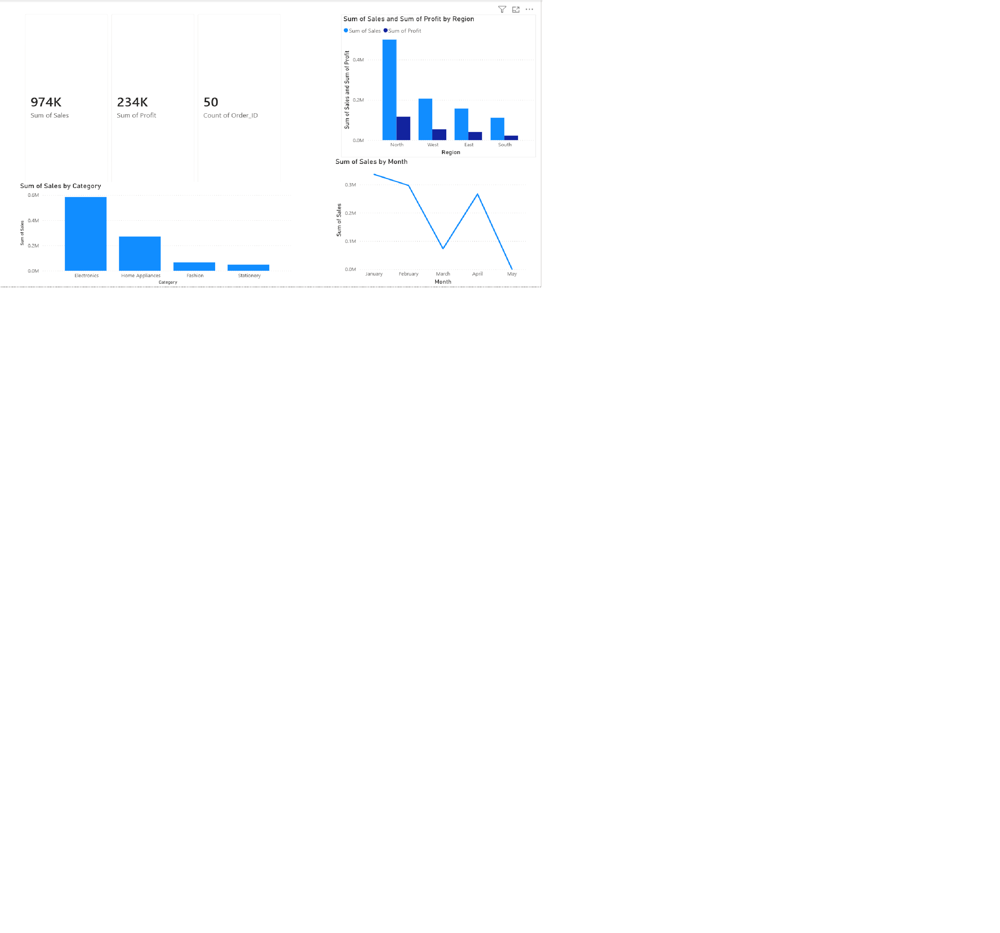

# E-commerce Sales Analysis

## Tools Used
- Python (Pandas)
- Power BI

##  Project Description
This project analyzes e-commerce sales data to understand business performance, customer behavior, and regional trends.

##  Key Insights
- Electronics is the top-performing category in terms of sales and profit
- East region shows strong sales and profitability
- Top customers contribute a major portion of total revenue
- Monthly sales show variation indicating possible seasonal trends

##  Dashboard

